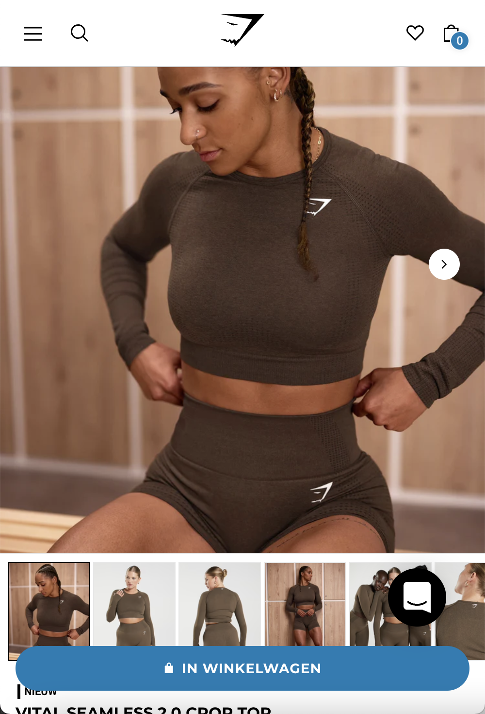
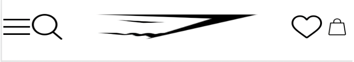

# Procesverslag
Markdown is een simpele manier om HTML te schrijven.  
Markdown cheat cheet: [Hulp bij het schrijven van Markdown](https://github.com/adam-p/markdown-here/wiki/Markdown-Cheatsheet).

Nb. De standaardstructuur en de spartaanse opmaak van de README.md zijn helemaal prima. Het gaat om de inhoud van je procesverslag. Besteedt de tijd voor pracht en praal aan je website.

Nb. Door *open* toe te voegen aan een *details* element kun je deze standaard open zetten. Fijn om dat steeds voor de relevante stuk(ken) te doen.

## Jij

  
uitwerken voor kick-off werkgroep

  ### Auteur:
  Susannah Rezk

  #### Je startniveau:
  Blauw

  #### Je focus:
  Surface plane
 

## Je website

  
uitwerken voor kick-off werkgroep

  ### Je opdracht:
  https://nl.gymshark.com/ 

  #### Screenshot(s) van de eerste pagina (small screen): 
  Homepage
  

  #### Screenshot(s) van de tweede pagina (small screen):
  Detailpagina (Gekozen product)
  
 

## Toegankelijkheidstest 1/2 (week 1)

  
uitwerken na test in 1e werkgroep

  ### Bevindingen
  Lijst met je bevindingen die in de test naar voren kwamen:
  - Een te grote hamburger menu
  - Korting actie is te klein

  #### Screenreader
  Hier korte omschrijving (met indien nodig afbeeldingen)
  - Je moet elke keer door je hamburger menu, ookal kokm je bij detailpagina
  - Bestellen ging wel oke, maar niet super handig 
  - Je kon wel overal naartoe met tab
  - Je kan ook terug met shift en tab
  Hier een omschrijving van hoe het opgelost kan worden (met indien nodig afbeeldingen)
  - Optie geven of je het hamburger menu nog een keer wil doorlopen.

  #### Muis en Toetsenbord 
  Hier korte omschrijving (met indien nodig afbeeldingen)

  Hier een omschrijving van hoe het opgelost kan worden (met indien nodig afbeeldingen)

  #### Motoriek (shocks, elastiekjes)
  Hier korte omschrijving (met indien nodig afbeeldingen)
  - Je kan niet door de website heen scrollen
  - Als je een product wil opzoeken, ben je best lang bezig met het typen
  Hier een omschrijving van hoe het opgelost kan worden (met indien nodig afbeeldingen)
  - Misschien de pijltjes op je toestenbord gebruiken om te scrollen
  - Een spraakoptie gebruiken om te typen bij de search balk

  #### Visueel (brillen, contrast, kleurenblind, dark/light). 
  Hier korte omschrijving (met indien nodig afbeeldingen)
  - Het midden kan je niet zien, maar alles eromheen wel
  - De kleine letters zijn niet te lezen
  - De afbeeldingen zijn niet te zien
  - De kopjes zijn niet goed te lezen
  Hier een omschrijving van hoe het opgelost kan worden (met indien nodig afbeeldingen) 
  - Grotere lettertypen
  - Opvallende kleuren gebruiken

## Breakdownschets (week 1)

  
uitwerken na afloop 2e werkgroep

  ### de hele pagina: 
  

  ### dynamisch deel (bijv menu): 
  

  ### wellicht nog een dynamisch deel (bijv filter): 
  

## Voortgang 1 (week 2)

  
uitwerken voor 1e voortgang

  ### Stand van zaken
  hier dit ging goed & dit was lastig (neem ook screenshots op van delen van je website en code)
  De opzet van mijn html ging goed. Het staat er zo in dat het duidelijk te lezen is. Bijna alle info van de homepage staat erin. Er mist alleen nog een klein stukje van de footer.
  

  ### Agenda voor meeting
  samen met je groepje opstellen

  | student 1      | student 2          | student 3    | student 4        |
  | Susannah       | ---                | ---          | ---              |
  | dit bespreken  | en dit             | en ik dit    | en dan ik dat    |
  | en dat ook nog | dit als er tijd is | nog een punt | dit wil ik zeker |
  | ...            | ...                | ...          | ...              |
  - Voor de zekerheid mijn HTML laten checken.
  - Welke code heb ik nodig om dit stukje in de footer na te maken met css?
  

  ### Verslag van meeting
  hier na afloop snel de uitkomsten van de meeting vastleggen

  - punt 1
    Mijn html staat goed onder elkaar en is duidelijk leesbaar.
  - punt 2
    Voor punt 2 heb ik de volgende code optie gekregen, die helpt bij het maken van de footer:
    
  - nog een punt
    Daarnaast heb ik nog een paar tips gekregen hoe ik mijn navigatiebalk het beste kan vormgeven met display grid, fr en span om het logo groter te maken dan de rest van de iconen. Daarnaast kan ik ook het 3de list item aanspreken en zo het logo aanpassen.
     

## Voortgang 2 (week 3)

  
uitwerken voor 2e voortgang

  ### Stand van zaken
  hier dit ging goed & dit was lastig (neem ook screenshots op van delen van je website en code)
  Het was best lastig om de foto's op het juiste formaat te krijgen. Het wilde maar niet ingezoomed worden.
   
  
  
  

  ### Agenda voor meeting
  Susannah Rezk

  - Hoe krijg ik mijn afbeeldingen op het juiste formaat?

  ### Verslag van meeting
  hier na afloop snel de uitkomsten van de meeting vastleggen

  - Ik mag de foto's laten zitten en dit een background color geven, want er is iets geks aan de hand met de afbeeldingen.

## Toegankelijkheidstest 2/2 (week 4)

  
uitwerken na test in 8e werkgroep

  ### Bevindingen
  Lijst met je bevindingen die in de test naar voren kwamen (geef ook aan wat er verbeterd is):

  #### Screenreader
  Hier korte omschrijving (met indien nodig afbeeldingen)

  Hier een omschrijving van hoe het opgelost kan worden (met indien nodig afbeeldingen)

  #### Muis en Toetsenbord 
  Hier korte omschrijving (met indien nodig afbeeldingen)

  Hier een omschrijving van hoe het opgelost kan worden (met indien nodig afbeeldingen)

  #### Motoriek (shocks, elastiekjes)
  Hier korte omschrijving (met indien nodig afbeeldingen)

  Hier een omschrijving van hoe het opgelost kan worden (met indien nodig afbeeldingen)

  #### Visueel (brillen, contrast, kleurenblind, dark/light). 
  Hier korte omschrijving (met indien nodig afbeeldingen)

  Hier een omschrijving van hoe het opgelost kan worden (met indien nodig afbeeldingen)

## Voortgang 3 (week 4)

  
uitwerken voor 3e voortgang

  ### Stand van zaken
  hier dit ging goed & dit was lastig (neem ook screenshots op van delen van je website en code)
  Na een tijdje puzzelen met de afbeeldingen, heb ik uiteindelijk toch nog een kleinere afbeeldingen kunnen vinden op het internet. Vervolgens had ik moeite om de afbeeldingen van de producten en de tekst onder en naast elkaar te krijgen. Na een tijdje puzzelen is het me gelukt om dit toe te passen met position absolute.

  

  ### Agenda voor meeting
  samen met je groepje opstellen

  - Ik was hier ziek bij de meeting.

  ### Verslag van meeting
  hier na afloop snel de uitkomsten van de meeting vastleggen

  Structuur HTML aanpassen, article om de blokjes, position absolute weg, met flexbox alles onder elkaar
  background images gebruiken zodat position absolute niet hoeft, zie screenshot.
  menu toevoegen

  - punt 1
  - punt 2
  - nog een punt
  - ...

## Eindgesprek (week 5)

  
uitwerken voor eindgesprek

  ### Je uitkomst - karakteristiek screenshots:
  

  ### Dit ging goed/Heb ik geleerd: 
  Korte omschrijving met plaatjes
  Op de meeste momenten ging het eigenlijk best soepel. Ik heb natuurlijk niet alles afgekregen, maar wat ik heb ging 9 v/d 10 keer goed. Ik ben erachter gekomen dat je Position absolute eigenlijk best makkelijk kan toepassen als je iets wil verschuiven naar de rechterkant van het scherm bijv. De scrol bar is me ook goed gelukt.
  
  
  
  

  ### Dit was lastig/Is niet gelukt:
  Korte omschrijving met plaatjes
  Bij de heren apex artikelen is het me niet gelukt om de tekst goed onder elkaar te krijgen. Mijn navbar werkt niet mee en de maten van het product blijven op de knop maattabel staan. 

  Het is soms nog best lastig om de code op de juiste manier toe te passen, maar als het me dan lukt is het dan weer wat makkelijker. En omdat ik nog niet klaar ben met me site, moet ik ook nog mijn knoppen vormgeven (active etc). En wat animaties toevoegen, zoals bij de 50% off tekst dat het naar voren en naar achteren springt. Bij de andere knoppen nog leuke en toffe animaties erbij toevoegen.
 
  
  

## Bronnenlijst

  
continu bijhouden terwijl je werkt

  Nb. Wees specifiek ('css-tricks' als bron is bijv. niet specifiek genoeg).

  1. Navbar icon hamburger menu https://www.flaticon.com/search?word=hamburger%20menu&order_by=4
  2. Navbar icon search https://www.flaticon.com/search?word=search&order_by=4
  3. Navbar logo gymshark https://logos-world.net/gymshark-logo/
  4. Navbar icon heart https://www.flaticon.com/free-icon/heart_1077035?term=heart&page=1&position=1&page=1&position=1&related_id=1077035&origin=search
  5. Navbar icon shopping bag https://www.flaticon.com/free-icon/shopping-bag_2567829?related_id=2567829
  6. Afbeelding 10 years strong introductie https://central.gymshark.com/article/10-years-strong-celebrating-gymsharks-10th-anniversary
  7. Afbeelding nieuw Apex introductie https://www.google.com/search?tbs=simg:CAQSjAEaiQELEKjU2AQaAghCDAsQsIynCBpiCmAIAxIoiA7oBMUOlQ6LDpwZmhmQDsYO-RjvOswu5TrtOrkv2i3uOt868TrqOhowc1mgv4YM6xmzbdLZdCaGX3VVmRvuauz-Ke3GYZmsAfX8YtNBYbce6NyXJ2c5IvXgIAQMCxCOrv4IGgoKCAgBEgRh65uwDA&sxsrf=ALiCzsbtNOOmDmBkUd9PNuZMoQ0jBPxtJA:1664956114451&tbm=isch&sa=X&ved=2ahUKEwj6spLuzMj6AhUN6qQKHQXJB_sQwg56BAgBEDk&biw=1440&bih=735&dpr=2#imgrc=jxA3sx4PTMrrZM 
  8. Afbeeldingen over de heren apex artikelen, adapt familie introductie, dames adapt artikelen, shop dames en shop heren  https://nl.gymshark.com/
  9. Afbeelding studentenkorting https://cdn.shopify.com/s/files/1/0185/2846/9056/files/11th_AUG_Discount_Providers_3_720x.jpg?v=1660210534
  10. Afbeelding cadeaukaart https://thegiftcarddock.com/product/gym-shark/
  11. Afbeelding klarna https://cdn.shopify.com/s/files/1/0185/2846/9056/files/11th_AUG_Discount_Providers_2_720x.jpg?v=1660210545
  12. Afbeeldingen in de footer over de social media https://www.pngall.com/
  13. Afbeelding brightness in te stellen https://developer.mozilla.org/en-US/docs/Web/CSS/filter-function/brightness
  14. Dropdown in de footer bij de kopjes HELP en PAGINA'S https://developer.mozilla.org/en-US/docs/Web/HTML/Element/details
  15. Afbeeldingen over de dames adapt ombre crop top https://nl.gymshark.com/
  16. Footer e-mail sign up https://images.ctfassets.net/wl6q2in9o7k3/78i6cwhCg8cVO59Dvlk7Gy/ec15b2ca715a0b1aa27be0fd09c6aa03/newsletter__1_.jpg
  17. Footer Gymshark training https://images.ctfassets.net/wl6q2in9o7k3/3TTQZzGVSeCd6TrrBs0OlS/16db4a41783e3ae43ac642c327aa82c9/new_training_app_footer.jpg
  18. Footer Gymshark Central https://images.ctfassets.net/wl6q2in9o7k3/4QtcnsrjM61MBOfKzadnle/a18d71a24ca40bbc8137b754927e9c75/blog.jpg
  19. JavaScript button groen laten worden https://developer.mozilla.org/en-US/docs/Web/API/Document/getElementById, Niels heeft hierbij geholpen.

