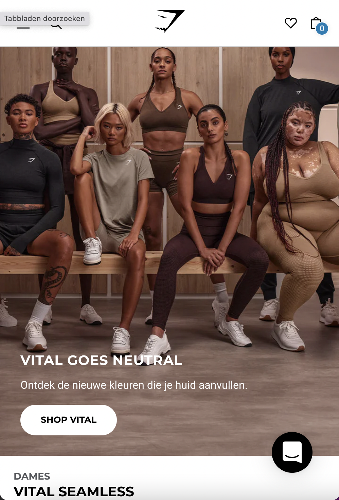
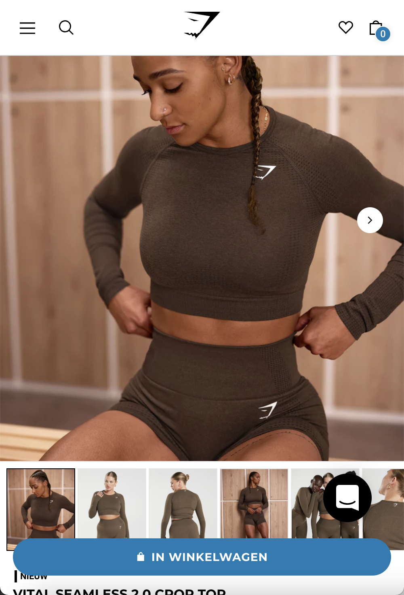

# Procesverslag
Markdown is een simpele manier om HTML te schrijven.  
Markdown cheat cheet: [Hulp bij het schrijven van Markdown](https://github.com/adam-p/markdown-here/wiki/Markdown-Cheatsheet).

Nb. De standaardstructuur en de spartaanse opmaak van de README.md zijn helemaal prima. Het gaat om de inhoud van je procesverslag. Besteedt de tijd voor pracht en praal aan je website.

Nb. Door *open* toe te voegen aan een *details* element kun je deze standaard open zetten. Fijn om dat steeds voor de relevante stuk(ken) te doen.

## Jij

  
uitwerken voor kick-off werkgroep

  ### Auteur:
  Susannah Rezk

  #### Je startniveau:
  Blauw

  #### Je focus:
  Surface plane
 

## Je website

  
uitwerken voor kick-off werkgroep

  ### Je opdracht:
  https://nl.gymshark.com/ 

  #### Screenshot(s) van de eerste pagina (small screen): 
  Homepage
  

  #### Screenshot(s) van de tweede pagina (small screen):
  Detailpagina (Gekozen product)
  
 

## Toegankelijkheidstest 1/2 (week 1)

  
uitwerken na test in 1e werkgroep

  ### Bevindingen
  Lijst met je bevindingen die in de test naar voren kwamen:
  - De licht grijze teksten zijn niet duidelijk te lezen.
  - Qua zicht kan je links en rechts wel dingen bekijken, maar niet in het midden dat is een blur. 
  - De kleine witte tekst op een foto is niet goed te lezen door de kleur. 
  - Bij de detailpagina zijn de foto's over het product niet overzichtelijk te zien. Je ziet dat er meerdere foto's staan, maar dat het niet duidelijk is     aangegeven.
  
  #### Screenreader
  Hier korte omschrijving (met indien nodig afbeeldingen)
  Tijdens de screenreader is het mij opgevallen dat het best lang duurt voordat je bij de producten langs kan gaan. Ze zeggen eerst stap voor stap het       hele menu.
  
  Hier een omschrijving van hoe het opgelost kan worden (met indien nodig afbeeldingen)
  Categorieën bij elkaar voegen, zodat ze sneller weten waar ze zijn.

  #### Muis en Toetsenbord 
  Hier korte omschrijving (met indien nodig afbeeldingen)
  - Als je bij een detailpagina aan komt van een product, moet je eerst weer het hele hamburger menu afgaan.
  - Als je je product in de winkelwagen wil plaatsen kan je niet meer verder navigeren.
  
  Hier een omschrijving van hoe het opgelost kan worden (met indien nodig afbeeldingen)
  Misschien opties geven of ze wel of niet het hele hamburger menu af willen gaan. Het kan best frusterend zijn als je dit elke keer moet aanhoren           wanneer je een product aanklinkt.

  #### Motoriek (shocks, elastiekjes)
  Hier korte omschrijving (met indien nodig afbeeldingen)
  De test met de elastiekjes verliep best lastig, omdat je drie vingers aan elkaar vast hebt gebonden. 
  Je kan dus wel weer klikken, maar niet scrollen.
  
  Hier een omschrijving van hoe het opgelost kan worden (met indien nodig afbeeldingen)

  #### Visueel (brillen, contrast, kleurenblind, dark/light). 
  Hier korte omschrijving (met indien nodig afbeeldingen)
  - Bij achromatopsie kan je niet zien of het rood, zwart, grijs etc is qua kleur van het product.
  - Bij tritanopie is de kleur bruin niet heel goed te zien, maar de rest van de kleuren wel.
  - Bij deuteranopie laat de kleuren niet meer goed zien. Kleur blauw valt dan weer wel op.
  - Protanopie komt veel overeen met deuteranopie, maar het beeld is alleen wat lcihter. De kleuren zijn lastig te onderscheiden. Blauw valt dan wel op.
  - Bij wazig zicht kan je de kleine teksten niet lezen, maar de grote teksten wel. De prijzen kan er nog wel uithalen, maar ook niet heel duidelijk.         Verder zijn de afbeeldingen wel te zien, maar kan je de bedrukkingen bijv. bij de mannenshirt niet zien. Je kan wel zien dat er iets is, maar niet wat     het is. De omschrijving tekst bij een product is niet te lezen. De knoppen zijn wel te zien, maar ook niet duidelijk. Je kan nog wel onderschijt maken     tussen de "in winkelwagen" knop en de "aan wishlist toevoegen". Het hamburger menu is ook niet te lezen, en de kopjes dames, heren en accessoires ook     niet.
  
  Hier een omschrijving van hoe het opgelost kan worden (met indien nodig afbeeldingen)
  

## Breakdownschets (week 1)

  
uitwerken na afloop 2e werkgroep

  ### de hele pagina: 
  

  ### dynamisch deel (bijv menu): 
  

  ### wellicht nog een dynamisch deel (bijv filter): 
  

## Voortgang 1 (week 2)

  
uitwerken voor 1e voortgang

  ### Stand van zaken
  hier dit ging goed & dit was lastig (neem ook screenshots op van delen van je website en code)

  ### Agenda voor meeting
  samen met je groepje opstellen

  | student 1      | student 2          | student 3    | student 4        |
  | ---            | ---                | ---          | ---              |
  | dit bespreken  | en dit             | en ik dit    | en dan ik dat    |
  | en dat ook nog | dit als er tijd is | nog een punt | dit wil ik zeker |
  | ...            | ...                | ...          | ...              |

  ### Verslag van meeting
  hier na afloop snel de uitkomsten van de meeting vastleggen

  - punt 1
  - punt 2
  - nog een punt
  - ...

## Voortgang 2 (week 3)

  
uitwerken voor 2e voortgang

  ### Stand van zaken
  hier dit ging goed & dit was lastig (neem ook screenshots op van delen van je website en code)

  ### Agenda voor meeting
  samen met je groepje opstellen

  | student 1      | student 2          | student 3    | student 4        |
  | ---            | ---                | ---          | ---              |
  | dit bespreken  | en dit             | en ik dit    | en dan ik dat    |
  | en dat ook nog | dit als er tijd is | nog een punt | dit wil ik zeker |
  | ...            | ...                | ...          | ...              |

  ### Verslag van meeting
  hier na afloop snel de uitkomsten van de meeting vastleggen

  - punt 1
  - punt 2
  - nog een punt
- ...

## Toegankelijkheidstest 2/2 (week 4)

  
uitwerken na test in 8e werkgroep

  ### Bevindingen
  Lijst met je bevindingen die in de test naar voren kwamen (geef ook aan wat er verbeterd is):

  #### Screenreader
  Hier korte omschrijving (met indien nodig afbeeldingen)

  Hier een omschrijving van hoe het opgelost kan worden (met indien nodig afbeeldingen)

  #### Muis en Toetsenbord 
  Hier korte omschrijving (met indien nodig afbeeldingen)

  Hier een omschrijving van hoe het opgelost kan worden (met indien nodig afbeeldingen)

  #### Motoriek (shocks, elastiekjes)
  Hier korte omschrijving (met indien nodig afbeeldingen)

  Hier een omschrijving van hoe het opgelost kan worden (met indien nodig afbeeldingen)

  #### Visueel (brillen, contrast, kleurenblind, dark/light). 
  Hier korte omschrijving (met indien nodig afbeeldingen)

  Hier een omschrijving van hoe het opgelost kan worden (met indien nodig afbeeldingen)

## Voortgang 3 (week 4)

  
uitwerken voor 3e voortgang

  ### Stand van zaken
  hier dit ging goed & dit was lastig (neem ook screenshots op van delen van je website en code)

  ### Agenda voor meeting
  samen met je groepje opstellen

  | student 1      | student 2          | student 3    | student 4        |
  | ---            | ---                | ---          | ---              |
  | dit bespreken  | en dit             | en ik dit    | en dan ik dat    |
  | en dat ook nog | dit als er tijd is | nog een punt | dit wil ik zeker |
  | ...            | ...                | ...          | ...              |

  ### Verslag van meeting
  hier na afloop snel de uitkomsten van de meeting vastleggen

  - punt 1
  - punt 2
  - nog een punt
  - ...

## Eindgesprek (week 5)

  
uitwerken voor eindgesprek

  ### Je uitkomst - karakteristiek screenshots:
  

  ### Dit ging goed/Heb ik geleerd: 
  Korte omschrijving met plaatjes

  

  ### Dit was lastig/Is niet gelukt:
  Korte omschrijving met plaatjes

  

## Bronnenlijst

  
continu bijhouden terwijl je werkt

  Nb. Wees specifiek ('css-tricks' als bron is bijv. niet specifiek genoeg).

  1. bron 1
  2. bron 2
  3. ...

